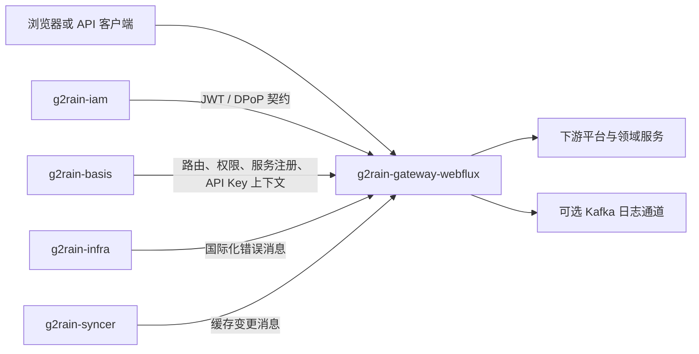

# 架构总览

`g2rain-gateway-webflux` 是基于 Spring Cloud Gateway WebFlux 的平台统一入口。它从 Basis 加载 API 路由与服务注册信息，在内存中维护 Spring Cloud Gateway 路由定义和路径匹配索引；同步消息到达后增量更新路由、权限、名称和静态访问令牌缓存。

入口过滤器依次建立请求级主体上下文、缓存请求/响应体、记录链路、分流 API Key 或 JWT/DPoP 认证、检查 API 权限和请求摘要，最后重建可信主体头并转发。成功 JSON 响应可补全应用或机构名称等展示字段；错误由全局处理器转换为统一结果。

网关不拥有用户、权限、路由或领域数据。它根据上游事实执行入口控制；下游服务不能因为请求经过网关就省略业务和数据级授权。
